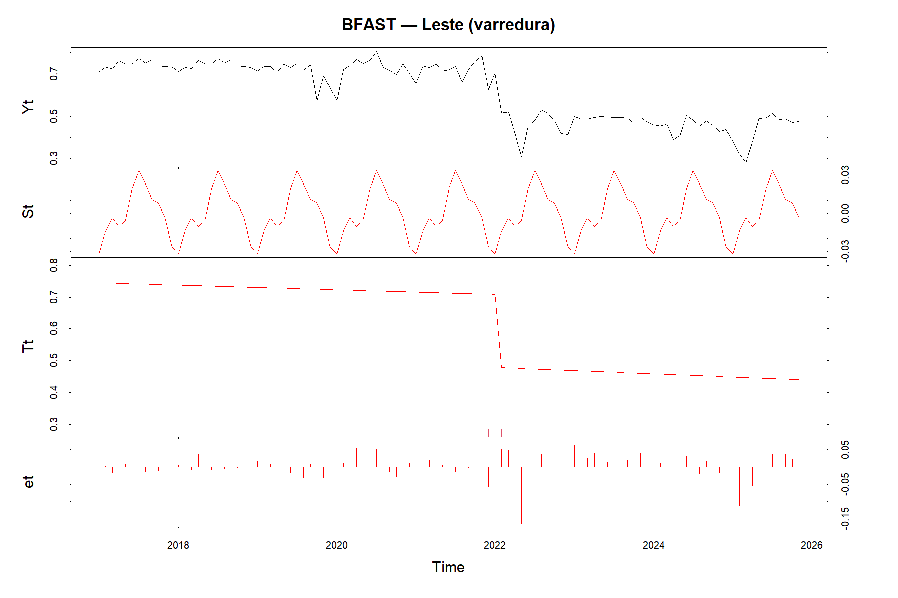
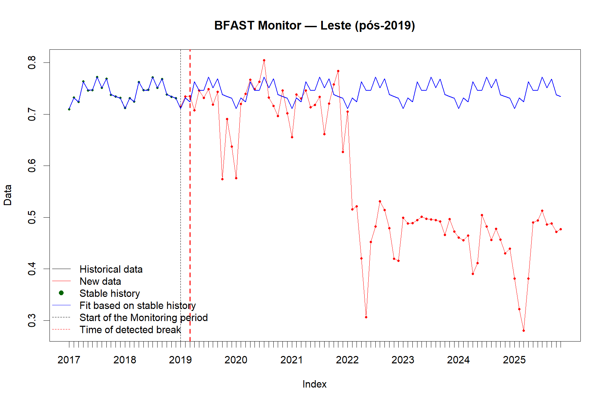
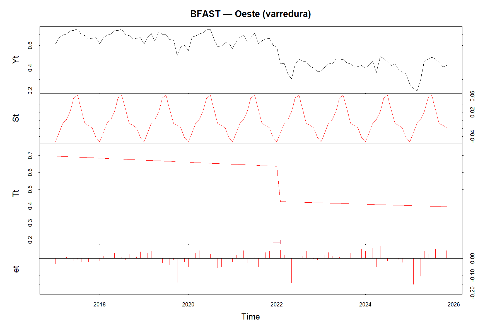
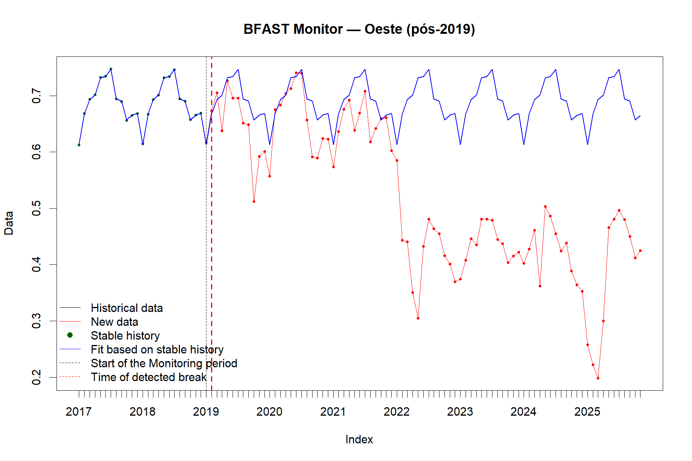
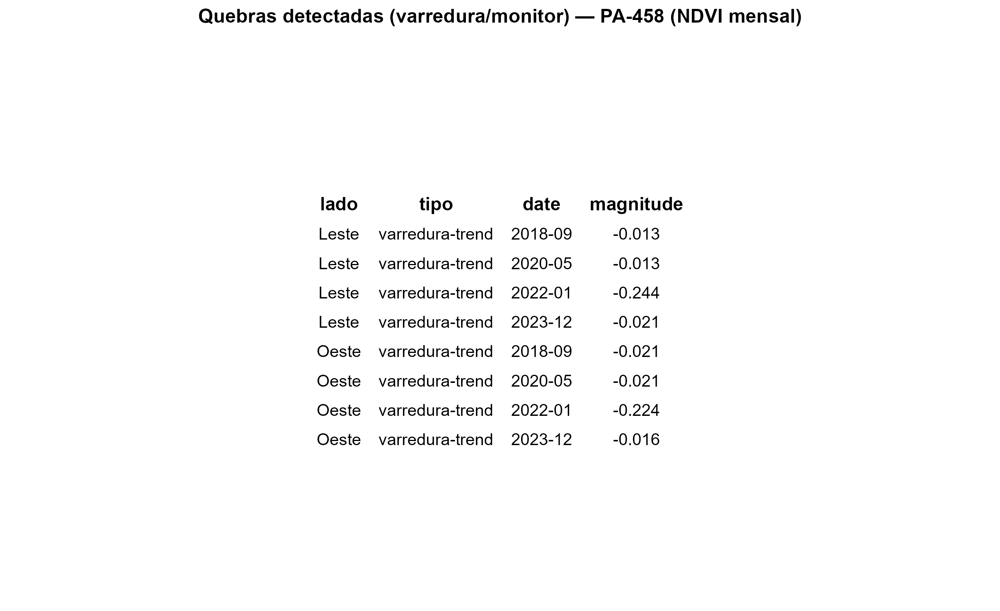

# Análise de Mudanças Estruturais na Cobertura Vegetal de Manguezais Impactados pela Rodovia PA-458 (Bragança-PA) por Meio de Séries Temporais de NDVI e Modelo BFAST (2019-2024)

**Autor:** Samuel da Costa dos Santos
**Orientadora:** Profa. Msc. Hellem Cristina Teixeira Rodrigues

Este repositório contém os códigos-fonte, dados e resultados gráficos gerados para o Trabalho de Conclusão de Curso (TCC) apresentado ao Curso de Especialização em Geoprocessamento, Levantamento e Interpretação de Solos da Universidade Federal Rural da Amazônia (UFRA).

## Resumo

Este estudo avalia a dinâmica temporal da vegetação de manguezais adjacentes à rodovia PA-458 (Bragança-PA) combinando séries temporais de NDVI com o modelo BFAST, a fim de identificar rupturas estruturais entre 2019 e 2024. Parte-se do objetivo de analisar processos de degradação e regeneração em ecossistemas costeiros sensíveis sob influência de infraestrutura linear, articulando monitoramento remoto e análise de mudanças (BFAST) para apoiar o planejamento e a gestão ambiental. A base de dados foi construída com imagens Sentinel-2 (10 m), processamento no Google Earth Engine e exportação de séries mensais por lado da via (leste/oeste) incluindo um recorte de 12 km iniciais seguidas de tratamento em R (pacotes bfast, forecast e strucchange), aplicando BFAST em modo varredura e monitor (histórico 2017-2018; início do monitoramento em 2019). Os resultados evidenciam declínio acentuado do NDVI a partir de 2022, com expansão de áreas <0,5 nos mapas anuais, e maior sensibilidade no trecho mais próximo ao início da estrada. No recorte de 12 km, as diferenças entre os lados foram marcantes: 2019-2021 mostraram NDVI mais alto no leste, mas ambos os lados sofreram queda abrupta após 2021 (-39% no leste; -38% no oeste até 2024), reduzindo a assimetria Leste-Oeste sem eliminar desigualdades estruturais. A interpretação integrada sugere que a combinação de alterações hidrológicas históricas, pressão antrópica e eventos recentes explica a ruptura 2021-2022 e a subsequente estabilização em patamar inferior, sobretudo no setor leste. Ao final, o trabalho demonstra a utilidade do NDVI combinado ao BFAST para marcar temporalmente mudanças críticas, priorizar trechos para restauração e embasar o manejo adaptativo de manguezais sob influência de obras lineares na Amazônia costeira.

## Códigos-Fonte

* [**`ndvi_bfast_pa458_manguezais.ipynb`**](ndvi_bfast_pa458_manguezais.ipynb): Notebook Jupyter (Python) para processamento em nuvem no Google Earth Engine (GEE). Inclui a filtragem de imagens Sentinel-2, cálculo de NDVI, e exportação das séries temporais.
* [**`bfast.R`**](bfast.R): Script em R para a análise das séries temporais de NDVI utilizando o modelo BFAST (modos *varredura* e *monitor*) para detecção de quebras estruturais.
* [**`classificacao_pyqgis.py`**](classificacao_pyqgis.py): Script em Python (PyQGIS) para automatizar a classificação e simbologia dos mapas anuais de NDVI no QGIS.

## Resultados e Figuras

### Mapas da Área de Estudo e NDVI

**Figura 1: Localização da Área de Estudo**

**Figura 5: Mapas Anuais de NDVI (2019-2024)**

### Análise NDVI (2019-2024)

**Figura 3: NDVI Médio (Percurso Total)**
.png)

**Figura 4: NDVI Médio (Primeiros 12km)**
.png)

**Tabela 1: Dados NDVI (Percurso Total)**

**Tabela 2: Dados NDVI (Primeiros 12km)**
.png)

### Análise de Rupturas Estruturais (BFAST)

**Figura 6: BFAST Varredura (Lado Leste)**

**Figura 7: BFAST Monitor (Lado Leste)**

**Figura 8: BFAST Varredura (Lado Oeste)**

**Figura 9: BFAST Monitor (Lado Oeste)**

**Tabela 3: Datas e Magnitudes das Quebras (Gráfico)**

## Dados

* [**`bfast_quebras_datas_magnitudes.csv`**](bfast_quebras_datas_magnitudes.csv): Tabela de dados (CSV) contendo as datas e magnitudes das rupturas estruturais detectadas pelo BFAST, conforme apresentado na Tabela 3 do TCC.
